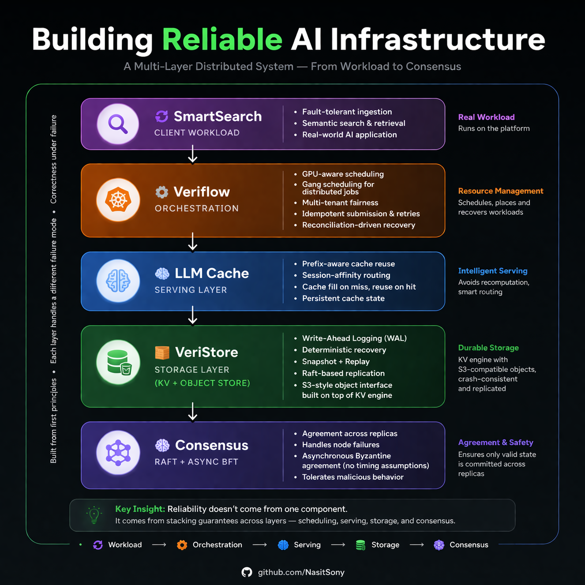

# Hi, I'm Nasit Sony 👋  
**Distributed Systems & AI Infrastructure Engineer**

I build correctness-first systems — from storage engines and consensus protocols to fault-tolerant pipelines and orchestration platforms.

My focus is simple:

> Systems must remain correct under failure — not just under ideal conditions.

---

## 🏗️ System Overview

  

  End-to-end AI infrastructure stack: workload → orchestration → serving → storage → consensus

---

## 🧠 The Idea

AI systems are not just pipelines.

They are **multi-layer distributed systems**, where each layer handles a different class of failures:

- crashes  
- retries & duplicate processing  
- network delays and reordering  
- resource contention  
- adversarial behavior (Byzantine faults)  

I design systems where **correctness is enforced at every layer**.

---

## ⚙️ What I Build (Layered System)

### 🔄 SmartSearch — Client Workload
Fault-tolerant ingestion and semantic retrieval system.

- Kafka replay & duplicate handling  
- Idempotent ingestion  
- Deterministic processing & recovery  

---

### ⚙️ Veriflow — Orchestration Layer
Kubernetes-based AI workload orchestrator.

- GPU-aware scheduling (type + count)  
- Gang scheduling for distributed training  
- Multi-tenant fairness & isolation  
- Idempotent job submission + retries  
- Reconciliation-driven execution  

---

### 🧠 LLM Serving Cache — Serving Layer
Inference-time control plane for cache placement and routing.

- Prefix-aware cache reuse  
- Session-affinity routing  
- Cache fill on miss → reuse on hit  
- Persistent cache state  

---

### 🧱 VeriStore — Storage Layer (KV + Object Store)
Crash-consistent storage engine with S3-style abstraction.

- Write-Ahead Logging (WAL)  
- Deterministic recovery via replay  
- Snapshot + restore  
- Raft-based replication  
- Object storage interface built on KV engine  

---

### 🧠 Consensus — Raft + Async BFT
Agreement layer across replicas.

- Leader-based consensus (Raft)  
- Asynchronous Byzantine agreement (MVBA)  
- Handles failures, delays, adversarial nodes  

---

### 🔁 AgentFlow — Workflow Engine
Failure-aware workflow execution system.

- Step-level retries  
- Timeout handling  
- Deterministic state transitions  

---

## 💥 Failure Model

Each layer addresses a specific class of failure:

| Layer | Handles |
|------|--------|
| Orchestration | Resource contention, partial execution |
| Serving | Redundant computation, routing correctness |
| Pipeline | Retries, duplicates |
| Storage | Crashes, partial writes |
| Consensus | Adversarial nodes, agreement |

---

## ⚡ Experience Snapshot

### 💰 Production Systems (Fintech)
- Built systems handling **$600M+ annual volume**  
- Focus: correctness, consistency, reliability  

### 🔬 Distributed Systems & BFT Research
- Published in Springer journals & conferences  
- Designed asynchronous BFT protocols  
- Bridging theory ↔ real systems  

---

## 💡 Engineering Philosophy

I design systems for failure, not just success.

I ask:

- What if a worker crashes mid-processing?  
- What if a write is partially persisted?  
- What if messages are replayed?  
- What if nodes behave maliciously?  

I build systems that:

- recover deterministically  
- enforce explicit state transitions  
- prevent duplication and corruption  
- remain correct under failure  

---

## 🧰 Tech Stack

**Languages:**  
Java, C++, Go, Python  

**Backend & Infra:**  
Spring Boot, Kafka, PostgreSQL, Kubernetes, Docker  

**Distributed Systems:**  
WAL, replication, consensus (Raft, BFT), idempotency, retries  

**AI Infrastructure:**  
Embeddings, RAG pipelines, vector search (pgvector)  

---

## 📚 Research

**Prioritized-MVBA — Asynchronous Byzantine Agreement Protocol**  
Published in Springer journals & international conferences  

🔗 https://scholar.google.com/citations?user=mBIQ1-0AAAAJ&hl=en  

---

## 🎯 Current Focus

- Distributed systems & storage engines  
- Fault-tolerant AI infrastructure  
- Consensus protocol engineering  

---

## 📬 Connect

🔗 LinkedIn: https://www.linkedin.com/in/nasitsony  
